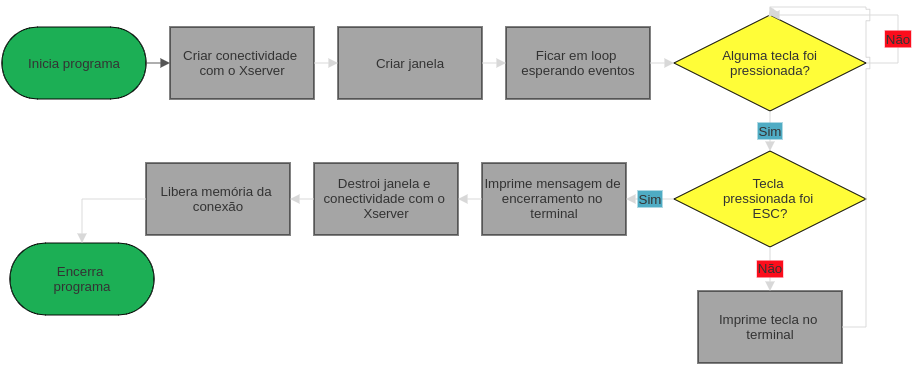

# Mini Library X

Então... basicamente a mlx é uma biblioteca gráfica para C, que permite que você crie coisas básicas como um wireframe, ou até [**DUKEfuckingNUKEM**](https://www.youtube.com/watch?v=46MALEk-7cE)😮... Mas, como  

> "Nem tudo que reluz é ouro." -Muita gente (-2022 - 2022)

Ela é documentada como todo jogo moderno sai... Uma bos-🤬. Mas não se preocupe, eu abrirei mão do meu tempo livre (e sanidade mental😵‍💫) pra te ajudar a destrinchar essa POR-🤬.

* [Fontes;](https://github.com/andreyvdl/MiniLibX_my_docs/blob/main/README.md#fontes)
* [Instalar;](https://github.com/andreyvdl/MiniLibX_my_docs/blob/main/README.md#instalar)
* [Básico;](https://github.com/andreyvdl/MiniLibX_my_docs/blob/main/README.md#basico)
* [Funções;](https://github.com/andreyvdl/MiniLibX_my_docs/blob/main/FUNCOES.md)

## Fontes

Não, não vou passar link de _[comic sans](https://youtu.be/wDgQdr8ZkTw)_ na verdade vou passar link de documentações feitas de forma séria, então caso você já tenha enjoado do meu texto... vaza, xispa daqui.   
* [harm-smits](https://harm-smits.github.io/42docs/libs/minilibx).   
* [Aurelien Brabant (brabo)](https://aurelienbrabant.fr/blog?tags=school+42).
* [Soraia Novaes](https://soraianovaes.notion.site/So-Long-c6d751eb784f46b8848a8cda5e3fdf4d).

## Instalar

Basicamente só segue o que tá escrito no [README](https://github.com/42Paris/minilibx-linux), a não ser que esteja no WSL, (aka Linux Subsistema do Windows) aí acho bom seguir esse [daqui](https://harm-smits.github.io/42docs/libs/minilibx/getting_started.html#getting-a-screen-on-windows-10-wsl2) (sinceramente fiz com [esse](https://github.com/codam-coding-college/MLX42#installation)).   
> "Ah Andrey, eu segui tudo direitinho mas não tenho essa `/usr/X11/lib` nem `/usr/X11/include` ou `/usr/X11/man/man3`"

CRIA.   
> "Ah mas Andrey, não é-"

**SÓ CRIA.**   
> "Mas não tenho permi-"

**`SUDO MKDIR`**   
> "Não consig-"

**`SUDO CP -RF`**   
Depois execute o shell de teste da mlx e torça pra dar tudo certo, porquê se algo der errado... boa sorte pra descobrir o que tá errado.

## Básico

Se tudo deu certo no teste, então tá na hora de por a mão na massa.   
Crie um arquivo que termine com `.c` (afinal todo arquivo de Clang é assim), e coloque o seguinte código:

```c
#include <stdio.h>
#include <stdlib.h>	
#include <mlx.h>

#define ESC 65307

typedef struct struct_ponteiros {
	void	*mlx;
	void	*janela;
}	tipo_ponteiros;

int	checa_teclas(int tecla, tipo_ponteiros *ponteiros) {
	if (tecla == ESC) {
		printf("Fechando a janela e encerrando o programa...\n");
		mlx_destroy_window(ponteiros->mlx, ponteiros->janela);
		mlx_destroy_display(ponteiros->mlx);
		free(ponteiros->mlx);
		exit(0);
	}
	else
		printf("Voce pressionou a tecla: %c\n", tecla);
	return (0);
}

int main() {
	tipo_ponteiros	ponteiros;
	void			*ponteiro_da_mlx;
	void			*ponteiro_da_janela;

	ponteiro_da_mlx = mlx_init();

	ponteiro_da_janela = mlx_new_window(ponteiro_da_mlx, 200, 200, "Janela");

	ponteiros.mlx = ponteiro_da_mlx;
	ponteiros.janela = ponteiro_da_janela;

	mlx_key_hook(ponteiros.janela, checa_teclas, &ponteiros);
	mlx_loop(ponteiro_da_mlx);
}
```

Compile ele com as seguintes flags: `-lmlx -lXext -lX11` e execute o binário (não se preocupe com o que cada flag e parte do código faz, explico depois), você agora deve ter uma janela com o título "Janela" com fundo preto, clique nela e pressione qualquer tecla do teclado, no terminal você verá uma mensagem, agora aperte a tecla `ESC`, mais uma mensagem vai aparecer no terminal e a janela vai sumir encerrando o programa (se você tentou fechar apertando o `X` no canto da janela, não se surpreenda por não funcionar, afinal ainda não programamos para isso).   
Agora vamos ver o fluxograma do programa para um melhor entendimento:   


Agora que você entendeu na prática e visualmente o que o programa faz, vamos falar na teoria.   
Nós criamos uma conexão entre nosso programa e o Xserver, depois criamos uma conexão entre nosso programa e uma janela gerada pelo Xserver, logo após dizemos para o Xserver ficar em loop esperando por eventos (como por exemplo, uma tecla ser pressionada), quando um evento acontece, o Xserver chama uma função que nós programamos, essa função recebe como parâmetro o código da tecla pressionada, e então nós verificamos se a tecla pressionada foi a `ESC`, se sim, nós encerramos o programa, se não, nós imprimimos a tecla pressionada no terminal.

Sobre as flags de compilação:   
`-lmlx` manda o compilador linkar com a biblioteca `mlx`, que nós compilamos e instalamos.   
`-lXext` manda o compilador linkar com a biblioteca `libxext-dev`, [libXext](https://packages.debian.org/sid/libxext-dev) fornece uma interface de cliente X Window System para diversas extensões para o protocolo X.   
`-lX11` manda o compilador linkar com a biblioteca `Xorg`, [X11](https://pt.wikipedia.org/wiki/X_Window_System) é um software de sistema e um protocolo que fornece uma base para interfaces gráficas de usuário (com o conceito de janelas) e funcionalidade rica de dispositivos de entrada para redes de computadores.

## FUNÇÕES

### mlx_clear_window

* Limpa a janela, removendo imagens, pixels e strings.   
* Recebe como parâmetros um ponteiro para a conexão com o **Xserver** e um ponteiro para a janela.   
* Retorno é indefinido.
```c
int	mlx_clear_window(void *mlx_ptr, void *win_ptr);
```

### mlx_destroy_display<sup>**1**</sup>

* Encerra a conexão com o **Xserver**.   
* Recebe como parâmetro um ponteiro para a conexão com o **Xserver**.   
* Retorno é indefinido.
```c
int	mlx_destroy_display(void *mlx_ptr);
```
<sub><sup>**1**</sup>Essa função não dá free no ponteiro, então tome cuidado para não vazar memória.</sub>

### mlx_destroy_image<sup>**1**</sup>

* Destroi uma imagem.   
* Recebe como parâmetros um ponteiro para a conexão com o **Xserver** e um ponteiro para a imagem.   
* Retorno é indefinido.
```c
int	mlx_destroy_image(void *mlx_ptr, void *img);
```
<sub><sup>**1**</sup>Essa função dá free no ponteiro, então não se preocupe com vazamentos.</sub>

### mlx_destroy_window<sup>**1**</sup>

* Destroi a janela.   
* Recebe como parâmetros um ponteiro para a conexão com o **Xserver** e um ponteiro para a janela.   
* Retorno é indefinido.
```c
int	mlx_destroy_window(void *mlx_ptr, void *win_ptr);
```
<sub><sup>**1**</sup>Essa função dá free no ponteiro, então não se preocupe com vazamentos.</sub>

### mlx_do_key_autorepeaton e mlx_do_key_autorepeatoff

* Repeaton e repeatoff, respectivamente ativam e desativam a repetição de teclas, ou seja, ao invés de ficar pressionando uma tecla você pode só segurar ela para continuar executando o evento do teclado.   
* Recebe como parâmetro um ponteiro para a conexão com o **Xserver**.   
* Retorno é indefinido.
```c
int	mlx_do_key_autorepeaton(void *mlx_ptr);

int	mlx_do_key_autorepeatoff(void *mlx_ptr);
```

### mlx_do_sync

* **Ela não é necessária**<sup>1</sup>, seu objetivo é garantir que todas as operações de desenho sejam realizas antes de prosseguir com outras operações.   
* Recebe como parâmetro um ponteiro para a conexão com o **Xserver**.   
* Retorno é indefinido.
```c
int	mlx_do_sync(void *mlx_ptr);
```
<sub><sup>1</sup>Digo que ela não é necessária, pois a MiniLibX já exibe tudo para você antes de executar o próximo evento.

### mlx_expose_hook

* Ela só funciona se você mudar o tamanho da janela (tive que testar no WSL), mesmo que o Manuel diga que funciona quando você minimiza a janela... [**NÃO ACREDITE NAS MENTIRAS DELE**](https://youtu.be/VIbjjDtQVhQ).   
* Recebe como parâmetros um ponteiro para a janela, uma função que será chamada e um ponteiro para um argumento.   
* Retorno é indefinido.   
* A função que é chamada recebe como parâmetro um ponteiro para um argumento.   
* A função que é chamada pode retornar o que ela quiser.
```c
int	mlx_expose_hook(void *win_ptr, int (*funct_ptr)(), void *param);

int	funct_ptr(void *param);
```

### mlx_get_color_value

* Ela transforma uma cor em um valor inteiro... só vi utilidade em querer saber o valor decimal de um hex... o que da pra fazer na internet **OU NA CALCULADORA DE PROGRAMADOR**😡...   
* Recebe como parâmetros um ponteiro para a conexão com o **Xserver** e uma cor em int😑...   
* Retorna um valor inteiro que representa a cor😶...
```c
int	mlx_get_color_value(void *mlx_ptr, int color);
```

### mlx_get_data_addr

* Ela cria array de tipo char do tamanho **total**<sup>1</sup> da imagem e coloca informação sobre os `bits por pixel`, `tamanho de 1 linha` e [`extremidade mais importante`](https://pt.wikipedia.org/wiki/Extremidade_(ordena%C3%A7%C3%A3o)).   
* Recebe como parâmetros um ponteiro para a imagem, um ponteiro para o tamanho de cada pixel, um ponteiro para o tamanho de cada linha e um ponteiro para o tamanho da imagem.   
* Retorna um ponteiro para o array de tipo char.
```c
char	*mlx_get_data_addr(void *img_ptr, int *bits_per_pixel, int *size_line, int *endian);
```
<sub><sup>1</sup>Com total eu teorizo que a formula para o tamanho é: `largura da imagem * altura da imagem * bits por pixel`, isso pois para conseguirmos pintar um pixel nessa imagem, acessamos o array na posição `y * size_line + x * (bpp / 8)` onde x é a posição da largura e y a da altura (no código fonte tem essa conta `(width + 32) * height * 4`, mas tenho quase certeza que ela retorna num número menor que o array final).</sub>

### mlx_hook

* Chama uma função quando um evento ocorre, o tipo de reação que terá para o evento depende da máscara, o usuário define qual evento, máscara, função e parãmetro devem ser usados (por exemplo pode se programar para que quando uma tecla for pressionada uma máscara e função de mouse seja executada, assim é possivel colocar um pixel na posição atual do mouse quando a tecla `Z` for pressionada).
* Recebe como parâmetro um ponteiro para a janela, um inteiro que representa um evento<sup>1</sup> da X11, um inteiro que representa uma máscara<sup>2</sup> da X11, uma função<sup>3</sup> que será chamada e um argumento.   
* Retorno é indeterminado.
```c
int	mlx_hook(void *win_ptr, int x_event, int x_mask, int (*funct_ptr)(), void *param);
```
<sub><sup>1</sup>Informações sobre os eventos podem ser encontrados [aqui](https://tronche.com/gui/x/xlib/events/types.html), já seus valores estão [aqui](https://harm-smits.github.io/42docs/libs/minilibx/events.html#x11-events).</sub>   
<sub><sup>2</sup>Informações sobre as máscaras podem ser encontradas [aqui](https://tronche.com/gui/x/xlib/events/mask.html), já seus valores estão [aqui](https://harm-smits.github.io/42docs/libs/minilibx/events.html#x11-masks).</sub>   
<sub><sup>3</sup>A função chamada deve respeitar as regras de parâmetro de seu evento, ou seja, se for um evento do teclado, a função deve ter como parâmetro um int com o keycode e um argumento, se for um evento de mouse a função deve ter como parâmetro um int para o botão, outro para a posição x, mais um para a posição y e um argumento, ela pode retornar o que quiser.</sub>

### mlx_init

* Inicializa a conexão com o **Xserver**.   
* Não tem parâmetros.   
* Retorna um ponteiro para a conexão criada.
```c
void	*mlx_init(void);
```

### mlx_key_hook

* Chama uma função quando um evento de tecla ocorre.   
* Recebe como parâmetros um ponteiro para a janela, uma função que será chamada e um argumento.   
* Retorno é indefinido.   
* A função chamada recebe como parâmetro um inteiro que representa o keycode da tecla pressionada e um argumento.   
* A função chamada pode retornar o que quiser.
```c
int	mlx_key_hook(void *win_ptr, int (*funct_ptr)(), void *param);

int	funct_ptr(int keycode, void *param);
```

### mlx_xpm_file_to_image

* Ela converte um arquivo [XPM](https://en.wikipedia.org/wiki/X_PixMap)<sup>1</sup> em um ponteiro para a imagem do arquivo.   
* Recebe como parâmetros um ponteiro para a conexão com o **Xserver**, uma string com o nome do arquivo, um ponteiro para armazenar sua largura e sua altura.   
* Retorna um ponteiro para a imagem do arquivo XPM.
```c
void	*mlx_xpm_file_to_image(void *mlx_ptr, char *filename, int *width, int *height);
```
<sub><sup>1</sup>O tipo do arquivo XPM é o XPM3, não se preocupe, você não precisa escrever pixel por pixel da imagem, pode utilizar sites que convertem um png ou jpg em xpm.</sub>   

### mlx_xpm_to_image<sup>1</sup>

* Ela converte um array de strings com estilo XPM3 em uma imagem.   
* Recebe como parâmetros um ponteiro para a conexão com o **Xserver**, um array de strings, um ponteiro para armazenar sua largura e altura.   
* Retorna um ponteiro para a imagem criada pelo array de strings.
```c
void	mlx_xpm_to_image(void *mlx_ptr, char **data, int *width, int *height);
```
<sub><sup>1</sup>As cores ficam bugadas, então recomendo usar o `mlx_xpm_file_to_image` para melhores resultados.</sub>

### mlx_loop

* Fica em loop chamando hook em uma ordem específica (expose->key_hook->mouse_hook->loop_hook).   
* Recebe como parâmetro uma ponteiro para a conexão com o **Xserver**.   
* Retorna `0`.
```c
int	mlx_loop(void *mlx_ptr);
```

### mlx_loop_end

* Encerra o loop.   
* Recebe como parâmetro um ponteiro para a conexão com o **Xserver**.   
* Retorna `1`.
```c
int	mlx_loop_end(void *mlx_ptr);
```

### mlx_loop_hook

* Executa uma função 1 vez a cada repetição do loop.   
* Recebe como parâmetros um ponteiro para o **Xserver**, uma função e um argumento.   
* Retorno indefinido.   
* A função chamada recebe como parâmetro um argumento.   
* A função chamada pode retornar o que quiser.
```c
int	mlx_loop_hook(void *mlx_ptr, int (*funct_ptr)(), void *param);

int	funct_ptr(void *param);
```

### mlx_mouse_move

* Supostamente deveria mover o mouse para a posição desejada, mas não funciona.   
* Recebe como parâmetros um ponteiro para a conexão **Xserver**, um ponteiro para a janela, uma posição x e uma posição y.   
* Retorna `0`.
```c
int	mlx_mouse_move(void *mlx_ptr, void *win_ptr, int x, int y);
```

### mlx_mouse_hide

* Supostamente deveria esconder o mouse, mas não funciona.   
* Recebe como parâmetros um ponteiro para a conexão **Xserver** e um ponteiro para a janela.   
* Retorno indefinido.
```c
int	mlx_mouse_hide(void *mlx_ptr, void *win_ptr);
```

### mlx_mouse_show

* Supostamente deveria mostrar o mouse, mas não funciona.   
* Recebe como parâmetros um ponteiro para a conexão **Xserver** e um ponteiro para a janela.   
* Retorno indefinido.
```c
int	mlx_mouse_show(void *mlx_ptr, void *win_ptr);
```

### mlx_mouse_get_pos

* Pega a posição do mouse na tela<sup>1</sup>.   
* Recebe como parâmetros um ponteiro para a conexão **Xserver**, um ponteiro para a janela, um ponteiro para armazenar a posição x e um ponteiro para armazenar a posição y.   
* Retorna `1`.
```c
int	mlx_mouse_get_pos(void *mlx_ptr, void *win_ptr, int *x, int *y);
```
<sub><sup>1</sup>Se o mouse estiver fora da janela o resultado é imprevísivel, mas não causa nenhum segfault.</sub>

### mlx_mouse_hook

* Chama uma função quando um evento de mouse ocorre.   
* Recebe como parâmetros um ponteiro para a janela, uma função que será chamada e um argumento.   
* Retorno indefinido.   
* A função chamada recebe como parâmetro, o botão do mouse pressionado, a posição x e y do mouse e um argumento.   
* A função chamada pode retornar o que quiser.
```c
int	mlx_mouse_hook(void *win_ptr, int (*funct_ptr)(), void *param);

int	funct_ptr(int button, int x, int y, void *param);
```

### mlx_new_image

* Cria uma nova imagem.   
* Recebe como parâmetros um ponteiro para a conexão com o **Xserver**, a largura e altura da imagem em pixels.   
* Retorna um ponteiro para a imagem criada.
```c
void	*mlx_new_image(void *mlx_ptr, int width, int height);
```

### mlx_new_window

* Inicializa uma janela.   
* Recebe como parâmetros um ponteiro para a conexão com o **Xserver**, o tamanho da janela em pixels (0 representa o canto superior esquerdo da tela, **width** avança para a direita e **height** avança para baixo) e o título da janela.   
* Retorna um ponteiro para a janela criada.
```c
void	*mlx_new_window(void *mlx_ptr, int width, int height, char *title);
```

### mlx_pixel_put

* Coloca um pixel na tela.   
* Recebe como parâmetros um ponteiro para a conexão com o **Xserver**, um ponteiro para a janela, a posição x e y do pixel e a cor do pixel.   
* Retorno indefinido.
```c
int	mlx_pixel_put(void *mlx_ptr, void *win_ptr, int x, int y, int color);
```

### mlx_put_image_to_window

* Coloca uma imagem na tela.   
* Recebe como parâmetros um ponteiro para a conexão com o **Xserver**, um ponteiro para a janela, um ponteiro para a imagem, a posição x e y da tela.   
* Retorno indefinido.
```c
int	mlx_put_image_to_window(void *mlx_ptr, void *win_ptr, void *img_ptr, int x, int y);
```

### mlx_get_screen_size

* Pega o tamanho do monitor.   
* Recebe como parâmetros um ponteiro para a conexão com o **Xserver**, um ponteiro para armazenar a largura e um ponteiro para armazenar a altura.   
* Retorno indefinido.
```c
int	mlx_get_screen_size(void *mlx_ptr, int *sizex, int *sizey);
```

### mlx_set_font 🚧🚧🚧🚧🚧🚧🚧🚧🚧🚧🚧🚧🚧🚧🚧🚧🚧🚧🚧🚧🚧🚧🚧🚧🚧🚧🚧

* Supostamente muda a fonte da função `mlx_string_put`, mas não funciona.   
* Recebe como parâmetros um ponteiro para a conexão com o **Xserver**, um ponteiro para a janela e o nome da fonte.   
* Retorno indefinido.
```c
int	mlx_set_font(void *mlx_ptr, void *win_ptr, char *name);
```

### mlx_string_put

* Coloca uma string na tela.   
* Recebe como parâmetros um ponteiro para a conexão com o **Xserver**, um ponteiro para a janela, a posição x, a posição y, a cor da string e a string.   
* Retorno indefinido.
```c
int	mlx_string_put(void *mlx_ptr, void *win_ptr, int x, int y, int color, char *string);
```

Caso queira testar algumas delas existem alguns arquivos .c númerados de `0` a `6`, fiz eles demonstrando algumas funções incluindo algumas que não funcionam (infelizmente a set_font não funciona num nível que causa erro).
