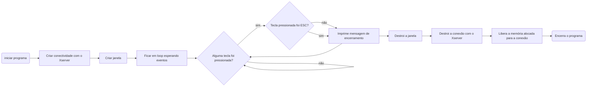

# Mini Library X

Então... basicamente a mlx é uma biblioteca gráfica para C, que permite que você crie coisas básicas como um joguinho, ou até **RAYfuckingTRACE**😮... Mas, como  

> "Nem tudo que reluz é ouro." -Muita gente (-2022 - 2022)

Ela é documentada como todo jogo moderno sai... Uma bos-🤬. Mas não se preocupe, eu abrirei mão do meu tempo livre (e sanidade mental😵‍💫) pra te ajudar a destrinchar essa POR-🤬.

* [Fontes;](https://github.com/andreyvdl/MiniLibX_my_docs/blob/main/README.md#fontes)
* [Instalar;](https://github.com/andreyvdl/MiniLibX_my_docs/blob/main/README.md#instalar)
* [Básico;](https://github.com/andreyvdl/MiniLibX_my_docs/blob/main/README.md#basico)
* Funções;

## Fontes

Não, não vou passar link de _[comic sans](https://youtu.be/wDgQdr8ZkTw)_ na verdade vou passar link de documentações feitas de forma séria, então caso você já tenha enjoado do meu texto... vaza, xispa daqui.   
* [harm-smits](https://harm-smits.github.io/42docs/libs/minilibx).   
* [Aurelien Brabant (brabo)](https://aurelienbrabant.fr/blog?tags=school+42).
* [Soraia Novaes](https://soraianovaes.notion.site/So-Long-c6d751eb784f46b8848a8cda5e3fdf4d).

## Instalar

Basicamente só segue o que tá escrito no [README](https://github.com/42Paris/minilibx-linux), a não ser que esteja no WSL, (aka Linux Subsistema do Windows) aí acho bom seguir esse [daqui](https://harm-smits.github.io/42docs/libs/minilibx/getting_started.html#getting-a-screen-on-windows-10-wsl2) (sinceramente fiz com [esse](https://github.com/codam-coding-college/MLX42#installation)).   
"Ah Andrey, eu segui tudo direitinho mas não tenho essa `/usr/X11/lib` nem `/usr/X11/include` ou `/usr/X11/man/man3`"   
CRIA.   
"Ah mas Andrey, não é-"   
**SÓ CRIA.**   
"Mas não tenho permi-"   
**`SUDO MKDIR`**   
"Não consig-"   
**`SUDO CP -RF`**   
Depois execute o shell de teste da mlx e torça pra dar tudo certo, porquê se algo der errado... boa sorte pra descobrir o que tá errado.

## Básico

Se tudo deu certo no teste, então tá na hora de por a mão na massa.   
Crie um arquivo que termine com `.c` (afinal todo arquivo de Clang é assim), e coloque o seguinte código:

```c
#include <stdio.h>
#include <stdlib.h>	
#include <mlx.h>

#define ESC 65307

typedef struct struct_ponteiros {
	void	*mlx;
	void	*janela;
}	tipo_ponteiros;

int	checa_teclas(int tecla, tipo_ponteiros *ponteiros) {
	if (tecla == ESC) {
		printf("Fechando a janela e encerrando o programa...\n");
		mlx_destroy_window(ponteiros->mlx, ponteiros->janela);
		mlx_destroy_display(ponteiros->mlx);
		free(ponteiros->mlx);
		exit(0);
	}
	else
		printf("Voce pressionou a tecla: %c\n", tecla);
	return (0);
}

int main() {
	tipo_ponteiros	ponteiros;
	void			*ponteiro_da_mlx;
	void			*ponteiro_da_janela;

	ponteiro_da_mlx = mlx_init();

	ponteiro_da_janela = mlx_new_window(ponteiro_da_mlx, 400, 300, "Janela");

	ponteiros.mlx = ponteiro_da_mlx;
	ponteiros.janela = ponteiro_da_janela;

	mlx_key_hook(ponteiros.janela, checa_teclas, &ponteiros);
	mlx_loop(ponteiro_da_mlx);
}
```

Compile ele com as seguintes flags: `-lmlx -lXext -lX11` e execute o binário (não se preocupe com o que cada flag e parte do código faz, explico depois), você agora deve ter uma janela com o título "Janela" com fundo preto, clique nela e pressione qualquer tecla do teclado, no terminal você verá uma mensagem, agora aperte a tecla `ESC`, mais uma mensagem vai aparecer no terminal e a janela vai sumir encerrando o programa (se você tentou fechar apertando o `X` no canto da janela, não se surpreenda por não funcionar, afinal ainda não programamos para isso).   
Agora vamos ver o fluxograma do programa para um melhor entendimento:



# 🚧 WIP 🚧
